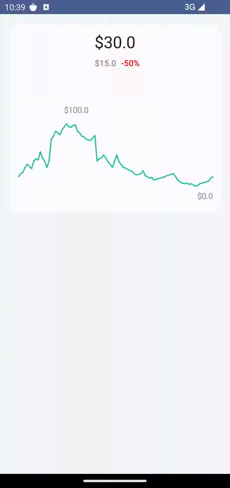

# Digi Plot- easy to use chart library with gesture detection for Android and Ios
[](https://www.android.com)
[](https://android-arsenal.com/api?level=24)
[](https://jitpack.io/#hamidfathi1998/Digi-Plot)

Chart Library built using Jetpack Compose and is highly customizable and has gesture detection like trust wallet. Made with ❤️ for Android Developers by Hamid Fathi.

<p align="left">
 <a></a>
</p>


# 💥 Setup
Add these to your `build.gradle` file

```groovy
repositories {
  google()
  mavenCentral()
}
dependencies {
    implementation 'com.github.hamidfathi1998:Digi-Plot:@VERSION'
}
```

# ⚡ Usage
A composable that draws a Line graph with the configurations provided by the LinePlot. The graph
can be scrolled, zoomed and touch dragged for selection. Every part of the line graph can be customized,
by changing the configuration in the LinePlot.


```kotlin
LineGraph(
    modifier = Modifier
        .fillMaxWidth()
        .height(200.dp),
    plot = LinePlot(
        horizontalExtraSpace = 20.dp,
        paddingTop = 50.dp,
        paddingBottom = 120.dp,
        isZoomAllowed = false,
        lines = getLinesDetails(lines = lines, density = density),
        selection = LinePlot.Selection(
            enabled = true,
            highlight = LinePlot.Connection(
                color = md_green,
                strokeWidth = 2.dp,
                cap = StrokeCap.Round,
                pathEffect = PathEffect.dashPathEffect(floatArrayOf(10f, 15f, 20f), 0f),
            ),
            detectionTime = 100L,
        ),
    ),
    onSelectionStart = { visibility.value = true },
    onSelectionEnd = { visibility.value = false },
)
```

for show the info when you touch a point you can use this help code
```kotlin
    val totalWidth = remember { mutableStateOf(0) }
    val density = LocalDensity.current
    Column(modifier = modifier.onGloballyPositioned {
        totalWidth.value = it.size.width
    }.background(color = Color.Transparent)) {
        val xOffset = remember { mutableStateOf(0f) }
        val cardWidth = remember { mutableStateOf(0) }
        val visibility = remember { mutableStateOf(false) }
        val points = remember { mutableStateOf(listOf<DataPoint>()) }

        Box(
            modifier = Modifier
                .height(120.dp)
                .fillMaxWidth(),
            contentAlignment = Alignment.Center
        ) {
            Surface(
                modifier = Modifier
                    .fillMaxSize()
            ) {
                Column(
                    Modifier
                        .fillMaxWidth()
                        .padding(horizontal = 8.dp),
                    verticalArrangement = Arrangement.Center,
                    horizontalAlignment = Alignment.CenterHorizontally
                ) {
                    var value = points.value
                    val lastValue = lines.last()
                    if (value.isEmpty()) {
                        value = lastValue
                    }
                    val diffPrice = value[0].y - lastValue[0].y
                    val diffPriceSign = if (diffPrice < 0) "-" else String()
                    val diffPresent = (lastValue[0].y * 100) / value[0].y
                    val diffPresentValue = diffPresent - 100
                    val time = DecimalFormat("#.#").format(value[0].x)
                    Text(
                        modifier = Modifier
                            .padding(vertical = 8.dp),
                        text = "$${value[0].y}",
                        style = MaterialTheme.typography.headlineMedium,
                        color = MaterialTheme.colorScheme.onBackground
                    )
                    Row(
                        Modifier
                            .padding(bottom = 8.dp)
                            .fillMaxWidth(),
                        horizontalArrangement = Arrangement.Center,
                        verticalAlignment = Alignment.CenterVertically
                    ) {
                        Text(
                            modifier = Modifier
                                .padding(horizontal = 8.dp),
                            text = "$diffPriceSign$$diffPrice",
                            style = MaterialTheme.typography.labelLarge,
                            color = Color.Gray
                        )
                        Text(
                            text = "${diffPresentValue.toInt()}%",
                            style = MaterialTheme.typography.labelLarge,
                            color = Color.Red
                        )
                    }
                    Box(
                        modifier = Modifier
                            .height(32.dp)
                            .fillMaxWidth()
                    ) {
                        Text(
                            textAlign = TextAlign.Center,
                            text = "${time.toInt()}:00",
                            style = MaterialTheme.typography.labelLarge,
                            color = Color.Gray,
                            modifier = Modifier
                                .padding(all = 4.dp)
                                .onGloballyPositioned {
                                    cardWidth.value = it.size.width
                                }
                                .graphicsLayer(translationX = xOffset.value)
                                .alpha(if (visibility.value) 1f else 0f),
                        )
                    }
                }
            }
        }

        LineGraph(
            modifier = Modifier
                .fillMaxWidth()
                .height(200.dp),
            plot = LinePlot(
                horizontalExtraSpace = 20.dp,
                paddingTop = 50.dp,
                paddingBottom = 120.dp,
                isZoomAllowed = false,
                lines = getLinesDetails(lines = lines, density = density),
                selection = LinePlot.Selection(
                    enabled = true,
                    highlight = LinePlot.Connection(
                        color = md_green,
                        strokeWidth = 2.dp,
                        cap = StrokeCap.Round,
                        pathEffect = PathEffect.dashPathEffect(floatArrayOf(10f, 15f, 20f), 0f),
                    ),
                    detectionTime = 100L,
                ),
            ),

            onSelectionStart = { visibility.value = true },
            onSelectionEnd = { visibility.value = false },

            ) { x, pts ->
            val cWidth = cardWidth.value.toFloat()
            var xCenter = x
            xCenter = when {
                xCenter + cWidth / 2f > totalWidth.value -> totalWidth.value - cWidth
                xCenter - cWidth / 2f < 0f -> 0f
                else -> xCenter - cWidth / 2f
            }
            xOffset.value = xCenter - (xCenter * 0.1f)
            points.value = pts
        }
    }
```

### LineGraph
- **plot** (the configuration to render the full graph)
- **modifier** (Modifier)
- **onSelectionStart** (invoked when the selection has started)
- **onSelectionEnd** (invoked when the selection has ended)
- **onSelection** (invoked when selection changes from one point to the next)

### LinePlot
- **lines** (list of lines to be represented)
- **grid** (rendering logic on how the Grid should be drawn. If null, no grid is drawn)
- **selection** (controls the touch and drag selection behaviour using Selection)
- **xAxis** (controls the behaviour, scale and drawing logic of the X Axis)
- **yAxis** (controls the behaviour, scale and drawing logic of the Y Axis)
- **isZoomAllowed** (if true, the graph will zoom on pinch zoom. If false, no zoom action.)
- **paddingTop** (adjusts the top padding of the graph. If you want to adjust the bottom padding, adjust the XAxis.paddingBottom)
- **paddingRight** (adjust the right padding of the graph. If you want to adjust the left padding, adjust the YAxis.paddingStart)
- **horizontalExtraSpace** (gives extra space to draw Intersection or Highlight at the left and right extremes of the graph. Adjust this if your graph looks like cropped at the left edge or the right edge)

### LinePlot.ITEMS
- **connection** (drawing logic for the line between two adjacent points. If null, no line is drawn)
- **intersection** (drawing logic to draw the point itself. If null, the point is not drawn)
- **highlight** (drawing logic to draw the highlight at the point when it is selected. If null, the point won't be highlighted on selection)
- **areaUnderLine** (drawing logic for the area under the line. This is the region that is formed by the intersection of the line, x-axis and y-axis)


## If this project helps you in anyway, show your love :heart: by putting a :star: on this project :v:

## Contributing

Please fork this repository and contribute back using
[pull requests](https://github.com/hamidfathi1998/Digi-Plot/pulls).

Any contributions, large or small, major features, bug fixes, are welcomed and appreciated
but will be thoroughly reviewed .

### - Contact - Let's become friend
- [Github](https://github.com/hamidfathi1998)
- [Linkedin](https://www.linkedin.com/in/hamidfathi1998/)